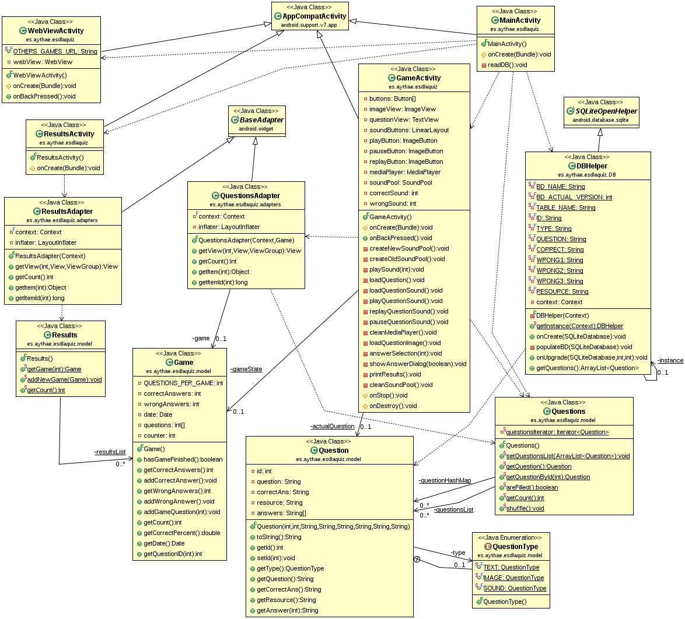

# ESDLA-Quiz
Android quiz game about the Lord Of The Rings (LOTR) in spanish.

## Game description
**ESDLA-Quiz** (El Señor De Los Anillos Quiz) consist in a multiple answer questions game (with 4 options each). The game has a total of 32 questions for now, although it would be easy to add more using the file [`app/src/main/res/raw/database.csv`](app/src/main/res/raw/database.csv) which is used to populate a SQLite data base on the Android device. The questions are divided in 3 types:
- Textual questions: which question and answers are in plain text (20)
- Image questions: which questions are about an image (7).
- Sound questions: which questions are about a sound (5).

The game also stores the past game results to show them in the "Estadísticas" window, but this store are made in memory, not in a database or the SD card, so if the user close the app, its past results will be deleted.

## Class and architectural diagrams

In the next architectural diagram it could be seen that the application follow a typical MVC architectural pattern.

In this other class diagram it could be appreciated how the classes of the app are related.

## Deployment of the app using the signed APK

A signed `.apk` has been generated to make the deployment of the app in an android device easily.
To deploy it you just need to insert the last release [`ESDLA-Quiz_x.x.apk`](https://github.com/AythaE/ESDLA-Quiz/releases) into the device and install it. It's possible that an error raise saying that is an insecure unknown source app, in that case you need to enable the Unknown Sources setting in the Security section of your device settings

## Tests in different devices and Android versions

This application has been develped to work with devices Android >= 4.4 (API 19). It has been tested using the android emulator [Genymotion](https://www.genymotion.com/) in a emulated Nexus 10 with Android 4.4.4 (API 19) and in an emulated Nexus 5X with Android 6.0.0 (API 23). The app also has been tested in a physical device, a Motorola Moto G LTE with Android 5.1 (API 22). No problems has been found during this tests.

## License
This project is under a GPL-3.0 license, for more details click [here](LICENSE).

The images and sounds of this app are property of its respective owners.

- Logo text font: Ringbearer © Pete Klassen, 2002 - http://www.thehutt.de/
- Correct question sound: Concerning the hobbits - The Lord of the Rings: The Fellowship of the Ring: Original Motion Picture Soundtrack ©  Howard Shore, the London Philharmonic Orchestra, the New Zealand Symphony Orchestra, and the London Oratory School Schola. 2001
- Wrong question sound: The Fields Of The Pelennor - The Lord of the Rings: The Return of the King: Original Motion Picture Soundtrack ©  Howard Shore, the London Philharmonic Orchestra, the London Voices, and the London Oratory School Schola. 2003
